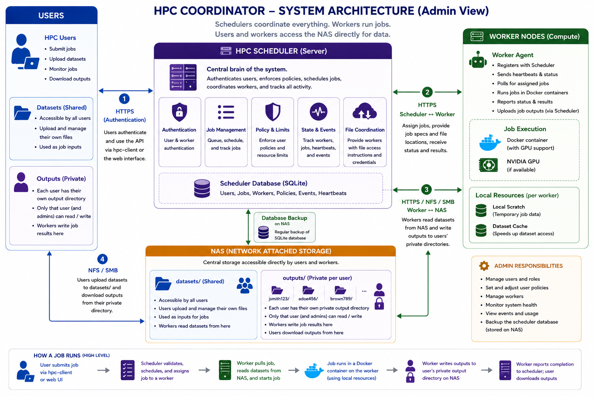

# HPC Client

The HPC Client is the command-line tool students and researchers use to submit Docker jobs to the CARES HPC Scheduler.



## Account Required

You cannot create your own account through the client.

Before using the HPC Client, contact the HPC administrators and request an account.

Provide:

- Your UPI
- Your University of Auckland email address
- Your name
- Your supervisor
- A short description of the work you want to run

After your account is created, the administrators will provide your login details.

## What You Can Do

With `hpc-client`, you can:

- Log in to the scheduler
- Submit jobs
- List your jobs
- Wait for a job to finish
- View job logs
- Cancel jobs

## Basic Workflow

```bash
hpc-client configure --scheduler-url http://<scheduler-host>:8080
hpc-client login <upi>
hpc-client submit job.json
hpc-client jobs
hpc-client wait <job_id>
hpc-client logs <job_id>
```

## Important Concepts
Jobs run inside Docker containers.

Containers are temporary. Save anything you want to keep into:

```bash
/workspace/output
```

Datasets requested in `job.json` are mounted read-only at:

```bash
/workspace/datasets/<dataset_name>
```
