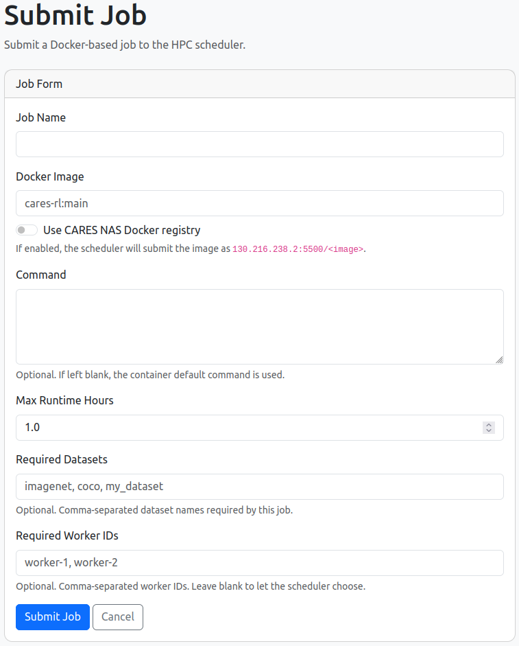
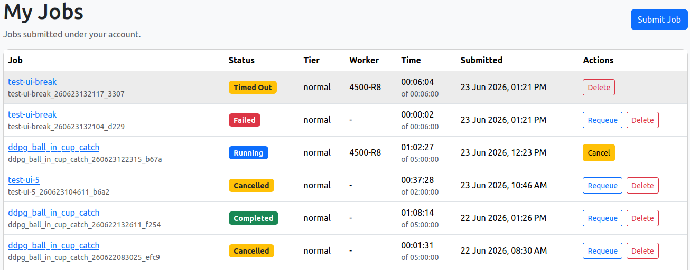

# HPC Scheduler

The HPC Scheduler provides a simple way to run long-running research workloads across the CARES compute cluster. Instead of connecting directly to individual machines, users submit Docker-based jobs through a web interface or python-api, specify the required runtime and datasets, and the scheduler automatically selects an appropriate worker machine to execute the job. The system manages job queues, tracks resource usage, stores outputs on the shared NAS, and provides access to logs and execution status through the web portal. This allows researchers and students to run experiments reliably across shared hardware while ensuring fair access to cluster resources.


## User Guide

This quick guide walks through the complete workflow for running jobs on the CARES HPC cluster.

By the end of this guide you will know how to:

- Access the HPC system
- Upload datasets
- Build Docker images
- Submit jobs
- Monitor progress
- Retrieve results
- Automate experiment submission using Python

Specific details about each section can be found in the corresponding documentation pages:

- [Docker Images](docker.md)
- [Datasets](datasets.md)
- [Outputs](outputs.md)

The typical workflow is:

```text
Write Code
    ↓
Build Docker Image
    ↓
Push Image
    ↓
Upload Dataset
    ↓
Submit Job
    ↓
Monitor Logs
    ↓
Collect Results
```

!!! info "Not for Interactive Workloads"
    The CARES HPC cluster is designed for running completed workloads, not for interactive software development.

    Before submitting a job you should:

    - Develop and test your code locally
    - Build a Docker image containing all required code and dependencies
    - Verify the Docker image runs correctly on your own machine
    - Upload any required datasets to the CARES NAS
    - Submit the job to the scheduler

!!! note "Jobs"
    A job file tells the scheduler:

    - which Docker image to run
    - how long the job is allowed to run
    - which datasets are required
    - whether the job needs a specific worker
    - what command to run inside the container

!!! note "Docker Containers are Temporary"
    All Jobs run inside Docker containers.

    Docker Containers are temporary. Save anything you want to keep into:

    ```bash
    /workspace/output
    ```

    Datasets requested in `job.json` are mounted read-only at:

    ```bash
    /workspace/datasets/<dataset_name>
    ```

!!! note "Outputs"
    Outputs are files you want to keep after a job finishes, such as:

    - Model checkpoints
    - Training logs
    - CSV files
    - Figures
    - Reports
    - Videos

    Must be saved to:

    ```text
    /workspace/output
    ```

    inside of the Docker container.

    The scheduler will then transfer those files back to the NAS and make them available under:

    ```text
    /cares-nas/hpc/outputs/<upi>/<job_id>
    ```

### Step 1: Request an Account

Accounts are created by the HPC administrators - please contact [Henry](https://caresuoa.slack.com/team/U010KNR38TZ), [Finn](https://caresuoa.slack.com/team/U04S833CTAL), or [David](https://caresuoa.slack.com/team/U010PFAJ469) on the [CARES Slack](https://join.slack.com/t/caresuoa/shared_invite/zt-1vex1wd77-Q3n4cVK3BQg_eaSjEkk19g) to request an account. For further support questions please contract the support team on the [cares-hpc-support](https://caresuoa.slack.com/archives/C0B0AJKMCPM) channel.

Contact the administrators and provide:

- Name - first and last
- UPI
- University email address
- Supervisor name
- Intended HPC usage

Once your account has been created you can log in to the scheduler.

You will will also recieve an account for the CARES NAS where you can upload datasets and access job outputs.

!!! warning "Users cannot create their own accounts."
    Users cannot create their own accounts through the client or web portal.

    Contact the HPC administrators to request an account before attempting to log in.

### Step 2: Develop Your Code
Write your code and verify it runs correctly on your own machine.

The HPC Scheduler only runs code that is included in your Docker image.

!!! warning "Code Must Be in the Docker Image"

    The HPC Scheduler only runs code that is included in your Docker image.

    You cannot run arbitrary commands on the worker machines.

    If you want to run a script, it must be included in the image and specified as the entry point.

### Step 3: Build a Docker Image

Example project:

```text
project/
├── Dockerfile
└── main.py
```

Example:

```python
import pathlib
import time

output_dir = pathlib.Path("/workspace/output")
output_dir.mkdir(parents=True, exist_ok=True)

for i in range(60):
    print(f"Count: {i}")
    time.sleep(1)

(output_dir / "result.txt").write_text(
    "Finished successfully\n",
    encoding="utf-8",
)
```

Dockerfile:

```dockerfile
FROM python:3.11-slim

WORKDIR /app

COPY main.py .

CMD ["python", "main.py"]
```

Build:

```bash
docker build -t count-to-60:latest .
```

Test locally:

```bash
docker run --rm count-to-60:latest
```

!!! warning "Code Must Be in the Docker Image"

    The HPC Scheduler only runs code that is included in your Docker image.

    You cannot run arbitrary commands on the worker machines.

    If you want to run a script, it must be included in the image and specified as the entry point.

!!! warning "Job Must Be Self-Contained"
    Jobs should be self-contained and executable without manual intervention.

    A submitted Docker image should contain everything required to perform the task:

    - Source code
    - Python packages
    - System dependencies
    - Configuration files
    - Training scripts
    - Evaluation scripts

### Step 4: Push the Image

The image must be pushed to a registry accessible by the HPC cluster. We currently support the CARES registry at `130.216.238.2:5500` or Docker Hub. We recommend using the CARES registry for better performance and reliability and unlimited storage. For  full instructions on how to build and push images to the CARES registry, see the [Docker Images Documentation](docker.md).

#### Pushing to the CARES Registry
Tag the image with the CARES registry address:

```bash
docker tag \
    count-to-60:latest \
    130.216.238.2:5500/count-to-60:latest
```

Push the image to the CARES registry:

```bash
docker push \
    130.216.238.2:5500/count-to-60:latest
```

Verify the image is available:

```bash
docker pull \
    130.216.238.2:5500/count-to-60:latest
```

!!! warning "Trust Docker Registry"
    See [Docker Registry Configuration](docker.md) for instructions on how to add the HPC Docker registry to your trusted registry list.

    This only needs to be configured once per machine.

    After the registry has been added to Docker's trusted registry list, images can be pushed and pulled normally.

#### Pushing to Docker Hub
Follow the instructions in the [Docker Hub Documentation](https://docs.docker.com/get-started/introduction/build-and-push-first-image/) to push your image to Docker Hub.

### Step 5: Upload a Dataset

Datasets are stored on the shared CARES NAS: [http://130.216.238.2:5500](http://130.216.238.2:5500). When you register for an HPC account, a folder is created for you on the NAS under `datasets/<upi>`. You can upload datasets to this folder and then specify them as required datasets when you submit your job. For full instructions on how to manage datasets, see the [Datasets Documentation](datasets.md).

Create a folder for your dataset in the `datasets` directory:

```text
datasets/
└── project_xyz
```

Upload your files:

```text
datasets/
└── project_xyz
    ├── train
    ├── test
    └── metadata.csv
```

The folder name becomes the dataset name for when you submit your job.

Example:

```json
{
  "required_datasets": [
    "project_xyz"
  ]
}
```

Inside the container:

```text
/workspace/datasets/project_xyz
```

### Step 6: Submit a Job
A job file is a simple JSON document that tells the scheduler how to run your Docker container.

#### Job Details
A job requires the following details to instruct the worker machines on how to run your containers: 

##### job_name

Human-readable name for the job.

```json
"job_name": "training_run_seed_1"
```

Examples:

```text
mnist_seed_1
ppo_ball_in_cup_seed_3
resnet50_baseline
```

##### image

Docker image to run.

CARES Registry example:

```json
"image": "130.216.238.2:5500/count-to-60:latest"
```

Docker Hub example:

```json
"image": "python:3.11-slim"
```

!!! note "UI handles Docker Hub and CARES Registry"
    The HPC web portal automatically handles both Docker Hub and the CARES Registry with a toggle button to indicate if the iamge is on the CARES registry.

    See [Docker Images Documentation](docker.md) for instructions on how to build and push images to the CARES registry.

##### max_runtime_hours

Maximum runtime in hours.

```json
"max_runtime_hours": 4.0
```

If a job exceeds this runtime, the worker terminates the container.

Examples:

| Value | Runtime |
|---------|---------|
| 0.5 | 30 minutes |
| 1.0 | 1 hour |
| 4.0 | 4 hours |
| 12.0 | 12 hours |

!!! note "Overstimate Runtime Limits"
    Users are expected to set a realistic runtime limit based on the expected duration of the job. It is better to set a slightly higher runtime limit than expected rather than setting a limit that is too low and having your job terminated before it finishes.

!!! warning "Set Realistic Runtime Limits"
    Setting an appropriate runtime limit helps the scheduler manage resources effectively.

    If your job genuinely requires a long runtime, set a higher limit.

    If your job is expected to finish quickly, set a lower limit to free up resources for other users.

##### command

Optional command override.

Use the Docker image default command:

```json
"command": null
```

Override the command:

```json
"command": "python train.py --seed 1"
```

The command runs inside the container.

!!! note "Use Command Overrides for Sweeps"
    Command overrides are useful for running multiple similar jobs with different parameters without needing to build a new Docker image for each job.

    For example, you can build one image containing your training code and then submit multiple jobs that override the command to specify different random seeds or hyperparameters.

    See the full instruction examples [Docker Images Documentation](docker.md) for how to set up your Docker image to support command overrides.

##### required_datasets

List of datasets required by the job.

No datasets:

```json
"required_datasets": []
```

One dataset:

```json
"required_datasets": ["mnist"]
```

Multiple datasets:

```json
"required_datasets": ["mnist", "cifar10"]
```

Datasets are mounted read-only inside the container:

```text
/workspace/datasets/<dataset_name>
```

Example:

```text
/workspace/datasets/mnist
```

!!! note "Datasets Must Be Uploaded Before Submitting Jobs"
    Datasets must be uploaded to the CARES NAS before submitting jobs that require them.

    If you submit a job that requires a dataset that does not exist, the job will fail to start.

    See [Datasets Documentation](datasets.md) for instructions on how to upload and manage datasets.

##### required_worker_ids

Normally leave empty:

```json
"required_worker_ids": []
```

Only use this when instructed by an administrator.

Example:

```json
"required_worker_ids": ["gpu01"]
```

!!! note "Future Feature: Select Specific Workers"
    In the future, we may allow users to select specific workers for their jobs.

    This would be useful for running jobs on machines with specific hardware (e.g. GPU machines) or for debugging issues that only occur on certain workers.

    For now, all jobs are automatically assigned to workers by the scheduler and users should avoid specify required worker IDs as it will limit the jobs ability to be scheduled.

#### Submit the Job
There are three ways to submit jobs:

##### A. HPC Web Portal
The HPC web portal provides a user-friendly interface for submitting and monitoring jobs.

Log in to the portal using your university UPI and provided password from the administrators. Click on `Submit Job`, fill in the required fields, and submit your job.



##### B. HPC-Client Command Line

The `hpc-client` command-line tool allows you to submit jobs directly from your terminal.

Create `job.json`:

```json
{
  "job_name": "count_to_60",
  "image": "130.216.238.2:5500/count-to-60:latest",
  "max_runtime_hours": 1.0,
  "command": null,
  "required_datasets": [],
  "required_worker_ids": []
}
```

Submit:

```bash
hpc-client login <upi>
hpc-client submit job.json
```

Example output:

```text
count_to_60_260616120000_abcd
```

Full instruction on how to use the `hpc-client` can be found in the [HPC Client Usage Guide](hpc-client/index.md).

##### C. Python API
The `hpc-client` can also be used directly from Python for autoamting job submissions. 

Example:

```python
from hpc_client import HPCClient

client = HPCClient(
    scheduler_url="http://scheduler.example.nz:8080"
)

client.login(
    username="abc123",
    password="your_password",
)

job_id = client.submit_job(
    {
        "job_name": "experiment_001",
        "image": "130.216.238.2:5500/my-project:latest",
        "max_runtime_hours": 4.0,
        "command": "python train.py --seed 1",
        "required_datasets": ["project_xyz"],
        "required_worker_ids": [],
    }
)

print(job_id)
```

This is useful for:

- Hyperparameter sweeps
- Reinforcement learning benchmarks
- Automated evaluation pipelines
- Batch experiment submission

Full instruction on how to use the `hpc-client` can be found in the [HPC Client Usage Guide](hpc-client/index.md).

### Step 7: Monitor the Job

You can monitor the status of your job through the HPC web portal or using the `hpc-client` automation.



### Step 8: Retrieve Results

Results are available after the job completes through the shared HPC storage on the CARES NAS.

The CARES NAS is accessible at: [http://130.216.238.2:5000](http://130.216.238.2:5000)

Anything written to:

```text
/workspace/output
```

within the Docker container is preserved.

Example:

```python
("/workspace/output/metrics.csv").write_text(
    "episode,reward\n1,123\n",
    encoding="utf-8",
)
```

Recommended structure:

```text
/workspace/output
├── checkpoints
├── figures
├── models
└── results
```

Full instruction on how to manage the outputs of your Docker container can be found in the [Outputs Documentation](outputs.md).

!!! warning "Outputs Must Be Written to /workspace/output"
    Only files written to `/workspace/output` are preserved after the job completes.

    Any files written to other directories inside the container will be lost.

## Best Practices
Below a few tips to help you get the most out of the HPC Scheduler.

### Submit Meaningful Job Names

Use names that identify the experiment.

Good:

```text
ppo_seed_1
resnet_lr_1e3_seed_2
dataset_ablation_seed_0
```

Poor:

```text
test
job
run
new
```

### Use Realistic Runtime Limits

Example:

```json
"max_runtime_hours": 4.0
```

Jobs exceeding their runtime limit are automatically terminated.

### Save Outputs Frequently

Long-running jobs should periodically save:

- checkpoints
- models
- metrics

to:

```text
/workspace/output
```

### Organise Outputs

Use:

```text
checkpoints/
figures/
models/
results/
```

rather than placing everything in a single directory.

### Keep Images Small

Smaller images start faster.

Avoid installing unnecessary packages.

### Test Locally First

Always verify:

```bash
docker run --rm image_name
```

before submitting a large job.

### Use Command Overrides for Sweeps

Build one Docker image and vary jobs run using override commands:

```json
"command": "python train.py --seed 1"
```

This avoids rebuilding the image for every experiment.

### Avoid Submitting Thousands of Jobs at Once

Submit large sweeps in batches.

This keeps the queue manageable and avoids hitting your active job limit.

!!! warning "Maximum Job Limit"
    Each user can have a maximum of 50 jobs in the queue to prevent spam.

    If you submit more than 50 jobs, they will be rejected until some of your existing jobs complete or are cancelled.

## Troubleshooting

??? failure "Job Never Starts"

    Workers may be busy.

    Check:

    ```bash
    hpc-client jobs
    ```

??? failure "Dataset Not Found"

    Verify the dataset exists on the CARES NAS.

??? failure "Image Cannot Be Pulled"

    Verify the image name and tag.

??? failure "Outputs Missing"

    Ensure outputs are written to:

    ```text
    /workspace/output
    ```

??? failure "Job Timed Out"

    Increase:

    ```json
    "max_runtime_hours"
    ```

    if the job genuinely requires more runtime.